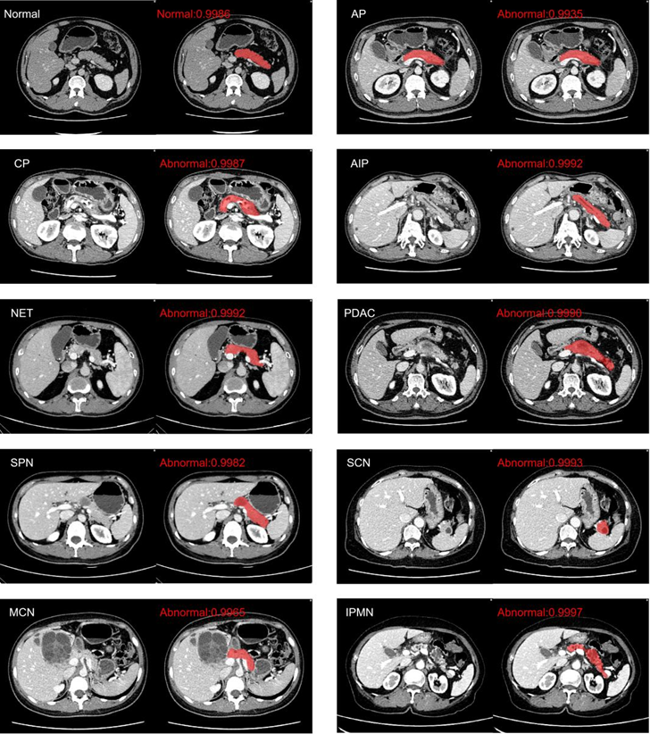

# eeMulNet

This code library provides fast diagnostic codes for pancreatic abnormalities in the portal phase of abdominal CT. It is mainly divided into two modules. Firstly, the segmentation network is used to extract the region of interest of the pancreas, and then the diagnostic results are output by fusing patient text information and region of interest features.

<p align="center"></p>

# Installation

---

Experimental Setup: The experiment was conducted using Python 3.9 on a Rocky 8.7 system. You can refer to the environment configuration file `environment.yml`

# ****Code Repository Features****

Divide the code into three parts based on its different functions:

- Segmentation model
- Language model
- Classification model

---

### Segmentation model：

We used the nnUnet ([MIC-DKFZ/nnUNet at nnunetv1 (github.com)](https://github.com/MIC-DKFZ/nnUNet/tree/nnunetv1)) network (nnUNetTrainerV2) to perform heavy head training on our dataset in the "3d_fullres" training mode in order to extract regions of interest from the pancreas. Use the trained segmentation model as a module for extracting regions of interest.


**Data preprocessing：**

`newCrop.py` ：Read the NII image and region of interest labels, extract the image regions corresponding to the labels, and save the cropping coordinates by modifying the NII image direction for restoration.

"If you are interested in segmentation networks, you can refer to nnUnet for deployment"

---

### Language model：

Our language model uses BERT Base and Chinese pre trained models to extract patient text information. （ [https://github.com/google-research/bert](https://github.com/google-research/bert) ）

`Extract_Text.py`: Implement feature extraction for patient text.

"If you are interested in language models, you can refer to BERT for deployment."

---

### classification model：

```
Save the preprocessed file in the following format：
All_data/
├──Normal
│   ├──Normal0001.nii.gz
│   ├──Normal0002.nii.gz
│   ├──...
├──Abnormal
│   ├──Abnormal0001.nii.gz
│   ├──Abnormal0002.nii.gz
│   ├──...

```


